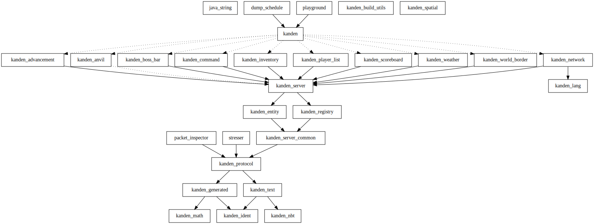

# Crates

The standard crates used in Kanden projects.

All crates here are exported by the main `kanden` crate. `kanden` is the intended interface for both end users and third-party plugin authors.

Crates are versioned in lockstep with the exception of `kanden_nbt`.

The output of `cargo depgraph --workspace-only | tred | dot -Tsvg -o assets/depgraph.svg` looks like this:

